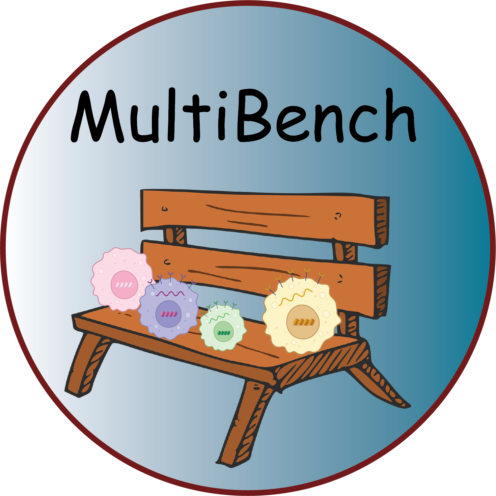

<h1 style="display: flex; align-items: center; font-size: 2em;">
  
  scMultiBench
</h1>

Multi-task benchmarking of single-cell multimodal omics integration methods

Single-cell multimodal omics technologies have empowered the profiling of complex biological systems at a resolution and scale that were previously unattainable. These biotechnologies have propelled the fast-paced innovation and development of data integration methods, leading to a critical need for their systematic categorisation, evaluation, and benchmark. Navigating and selecting the most pertinent integration approach poses a significant challenge, contingent upon the tasks relevant to the study goals and the combination of modalities and batches present in the data at hand. Understanding how well each method performs multiple tasks, including dimension reduction, batch correction, cell type classification and clustering, imputation, feature selection, and spatial registration, and at which combinations will help guide this decision. This study aims to develop a much-needed guideline on choosing the most appropriate method for single-cell multimodal omics data analysis through a systematic categorisation and comprehensive benchmarking of current methods.

## Integration Tools

In this benchmark, we evaluated 40 integration methods across the four data integration categories on 64 real datasets and 22 simulated datasets on a Ubuntu system with  RTX3090 GPU. In particular, we include 18 vertical integration methods, 14 diagonal integration tools, 12 mosaic integration tools, and 15 cross integration tools. The installation environment is set up according to the respective tutorials. Tools that are compared include:

Vertical Integration (Dimension Reduction and Clustering):
- [totalVI](https://docs.scvi-tools.org/en/stable/tutorials/notebooks/multimodal/totalVI.html) v1.1.2
- [sciPENN](https://github.com/jlakkis/sciPENN) v1.0.0
- [Concerto](https://github.com/melobio/Concerto-reproducibility) Github Version: ab1fc7f
- [scMSI](https://github.com/ChengmingZhang-CAS/scMSI-master) Github Version: dffcbb2
- [Matilda](https://github.com/PYangLab/Matilda) Github Version: 7d71480
- [MOFA+](https://biofam.github.io/MOFA2/) v1.6.0
- [Multigrate](https://multigrate.readthedocs.io/en/latest/index.html) v0.0.2
- [UINMF](http://htmlpreview.github.io/?https://github.com/welch-lab/liger/blob/master/vignettes/UINMF_vignette.html) v2.0.1
- [scMoMaT](https://github.com/PeterZZQ/scMoMaT) v0.2.2
- [Seurat_WNN](https://satijalab.org/seurat/articles/weighted_nearest_neighbor_analysis) v5.0.2
- [scMM](https://github.com/kodaim1115/scMM) Github Version: c5c8579
- [scMDC](https://github.com/xianglin226/scMDC/tree/v1.0.0) Github Version: 43b0c3a
- [moETM](https://github.com/manqizhou/moETM) Github Version: c2eaa97
- [VIMCCA](https://github.com/jhu99/scbean) Github Version: 0.5.6
- [iPOLNG](https://github.com/cuhklinlab/iPoLNG) v0.0.2
- [MIRA](https://github.com/cistrome/MIRA) v2.1.0
- [UnitedNet](https://github.com/LiuLab-Bioelectronics-Harvard/UnitedNet) Github Version: 3689da8
- [scMVP](https://github.com/bm2-lab/scMVP) Github Version: fc61e4d

Vertical Integration (Feature Selection):
- [scMoMaT](https://github.com/PeterZZQ/scMoMaT) v0.2.2
- [Matilda](https://github.com/PYangLab/Matilda) Github Version: 7d71480
- [MOFA+](https://biofam.github.io/MOFA2/) v1.6.0
  
Diagonal Integration (Dimension Reduction, Batch Correction, Clustering, Classification):
- [scBridge](https://github.com/XLearning-SCU/scBridge) Github Version: ff17561
- [Portal](https://github.com/YangLabHKUST/Portal) v1.0.2
- [SCALEX](https://github.com/jsxlei/SCALEX) v1.0.2
- [VIPCCA](https://github.com/jhu99/vipcca) v0.2.7
- [Seurat v3](https://satijalab.org/seurat/articles/seurat5_atacseq_integration_vignette) v5.0.2
- [MultiMAP](https://github.com/Teichlab/MultiMAP) Github Version: 681e608
- [Seurat v5](https://satijalab.org/seurat/articles/seurat5_integration_bridge) v5.0.2
- [sciCAN](https://github.com/rpmccordlab/sciCAN) Github Version: ad71bba 
- [Conos](https://github.com/kharchenkolab/conos) v1.4.6
- [iNMF](https://github.com/welch-lab/liger) v2.0.1
- [online iNMF](http://htmlpreview.github.io/?https://github.com/welch-lab/liger/blob/master/vignettes/UINMF_vignette.html) v2.0.1
- [scJoint](https://github.com/SydneyBioX/scJoint)  Github Version: cbbfa5d
- [GLUE](https://github.com/gao-lab/GLUE) v0.3.2
- [uniPort](https://uniport.readthedocs.io/en/latest/index.html) v1.2.2

Mosaic Integration (Dimension Reduction, Batch Correction, Clustering, Classification):
- [MultiVI](https://docs.scvi-tools.org/en/stable/tutorials/notebooks/multimodal/MultiVI_tutorial.html) v1.1.2
- [scMoMaT](https://github.com/PeterZZQ/scMoMaT) v0.2.2
- [StabMap](https://github.com/MarioniLab/StabMap) v0.1.8
- [Cobolt](https://github.com/epurdom/cobolt) v1.0.1
- [UINMF](http://htmlpreview.github.io/?https://github.com/welch-lab/liger/blob/master/vignettes/UINMF_vignette.html) v2.0.1
- [Multigrate](https://multigrate.readthedocs.io/en/latest/index.html) v0.0.2
- [SMILE](https://github.com/rpmccordlab/SMILE) Github Version: a2e2ca6

Mosaic Integration (Imputation):
- [scMM](https://github.com/kodaim1115/scMM) Github Version: c5c8579
- [moETM](https://github.com/manqizhou/moETM) Github Version: ad89fe2
- [UnitedNet](https://github.com/LiuLab-Bioelectronics-Harvard/UnitedNet) Github Version: 3689da8
- [totalVI](https://docs.scvi-tools.org/en/stable/tutorials/notebooks/multimodal/totalVI.html) v1.1.2
- [sciPENN](https://github.com/jlakkis/sciPENN) v1.0.0
- [StabMap](https://github.com/MarioniLab/StabMap) v0.1.8
- [MultiVI](https://docs.scvi-tools.org/en/stable/tutorials/notebooks/multimodal/MultiVI_tutorial.html) v1.1.2
  
Cross Integration (Dimension Reduction, Batch Correction, Clustering, Classification):
- [totalVI](https://docs.scvi-tools.org/en/stable/tutorials/notebooks/multimodal/totalVI.html) v1.1.2
- [scMoMaT](https://github.com/PeterZZQ/scMoMaT) v0.2.2
- [UnitedNet](https://github.com/LiuLab-Bioelectronics-Harvard/UnitedNet) Github Version: 3689da8
- [sciPENN](https://github.com/jlakkis/sciPENN) v1.0.0
- [Concerto](https://github.com/melobio/Concerto-reproducibility) Github Version: ab1fc7f
- [scMDC](https://github.com/xianglin226/scMDC/tree/v1.0.0) Github Version:  43b0c3a
- [StabMap](https://github.com/MarioniLab/StabMap) v0.1.8
- [UINMF](http://htmlpreview.github.io/?https://github.com/welch-lab/liger/blob/master/vignettes/UINMF_vignette.html) v2.0.1
- [scMM](https://github.com/kodaim1115/scMM) Github Version: c5c8579
- [MOFA+](https://biofam.github.io/MOFA2/) v1.6.0
- [Multigrate](https://multigrate.readthedocs.io/en/latest/index.html) v0.0.2

Cross Integration (Spatial Registration):
- [PASTE] (both pairwise and centre versions)(https://github.com/raphael-group/paste) v1.4.0
- [PASTE2](https://github.com/raphael-group/paste2) Gihub Version: a419f02 
- [SPIRAL](https://github.com/guott15/SPIRAL/tree/main) v1.0
- [GPSA](https://github.com/andrewcharlesjones/spatial-alignment) v0.8
  
Note that the installation time for tools may vary depending on the method used. For more detailed information, please refer to the original publication. For built-in classification, the classification scripts are provided in their corresponding method folders within the [tools_scripts] directory. For additional modules (such as kNN, SVM, random forest, and MLP), the scripts are provided in the [classification] directory.

## Evaluation Pipeline

All evaluation pipelines can be found within the [metrics](https://github.com/PYangLab/scMultiBench/tree/main/metrics) folder. Example datasets are stored in the 'example_data' folder. For spatial registration data, users are required to download it from [link](https://drive.google.com/drive/folders/1pS3GzJrCipB13Am3PVjCfzPtXgTHm7wv?usp=share_link), and then put it in the 'example_data/spatial/' folder. 

## Dataset

The processed datasets can be downloaded from [link](https://www.dropbox.com/scl/fo/6lismnrtgt4jm4ogvdmx2/AAcw4oqSTNjoOGoTvPVZPVU?rlkey=izc0rghdcjc0tyv8hgt3a6yws&st=037efszp&dl=0).

## Shiny

Explore method performance in depth with our interactive Shiny app (http://), designed for dynamic visualization of benchmark results.

## License

This project is covered under the Apache 2.0 License.
